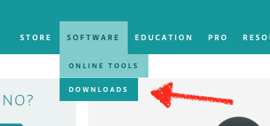
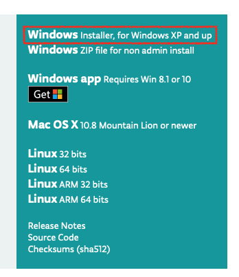
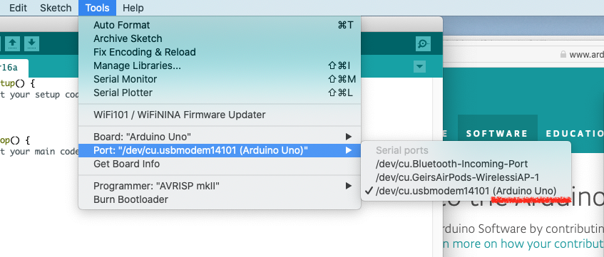
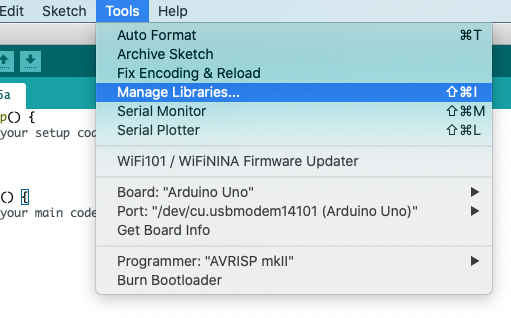

# Arduino hugbúnaðurinn

  - [Grunnhugbúnaður](#grunnhugbúnaður)
  - [Auka forritasöfn](#auka-forritasöfn)

## Grunnhugbúnaður

Til að setja kóða á Arduino tölvuna þarf að nota forrit sem þú getur sótt á [Arduiono.cc](https://www.arduino.cc) vefsíðuna.

Farðu inn á þá síðu og veldu Software -> Downloads:

Þegar þú ert komin(n) á Downloads síðuna veldu þá viðeigandi pakka (flestir ættu að velja þennan efsta):

Á síðunni sem opnast þá þarf að smella á *Just Download*:

Arduino umhverfið er svo sett upp eins og hvert annað forrit og er óhætt að nota allar sjálfgefnar stillingarnar.

Ræstu nú Arduino forritið og tengdu Arduino tölvuna þína með USB snúrunni við tölvuna.

Þú þarft svo að segja Arudino forritinu í hvaða USB porti Arduino tölvan er tengd. Það gerir þú með því að smella á Tools -> Port og veldu svo það port sem við stendur (Arduino Uno):

### Reklar (e. driver) ef þarf

- [Windows](https://github.com/VESM1VS/AFANGI/raw/main/Kennsluefni/CP210x_6.7.4.zip)
- [Mac](https://wiki.keyestudio.com/How_to_Install_the_Driver_of_CP2102_on_MAC_System)

## Auka forritasöfn

Stundum þarf að setja inn auka forritasöfn (e. library). Hér er dæmi um hvernig *ToneLibrary* safnið er sett inn.

Til að setja það inn ferðu í Tools -> Manage Libraries...:

Þá opnast Library Manager glugginn og þá slærðu inn *tonelibrary* í leitarsvæðið og smellir svo á Install hnappinn:

